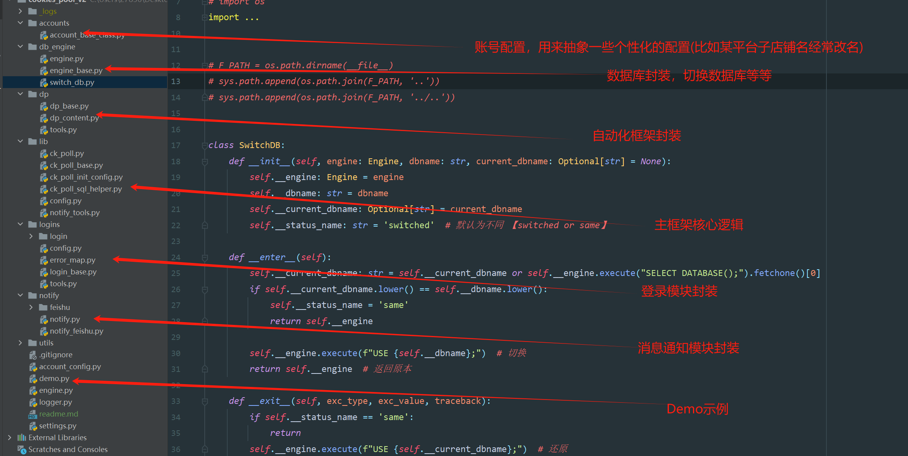
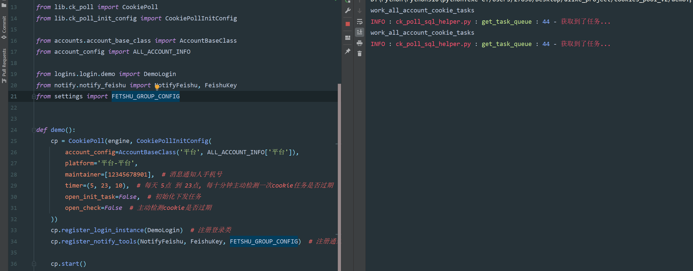

# CookeisPoll

cookie维护

目的: `登录业务解耦` `减少代码维护成本`

github: `https://github.com/ylw00/cookies_pool_v2`


## 依赖
```
python==3.9.9

DrissionPage==4.0.4.25

SQLAlchemy==1.4.7
pandas==1.3.5

loguru==0.7.2
```

## 1- 背景
- 业务和登录解耦, 减少业务代码的维护成本
- 增加cookie的利用率和代码的稳定性

## 2- 目录


## 3- 实现模块
- 维护模块
- 登录类
- 消息通知类
```python
# 先看demo可能不会理解起来那么抽象
from engine import engine
from lib.ck_poll import CookiePoll
from lib.ck_poll_init_config import CookiePollInitConfig

from accounts.account_base_class import AccountBaseClass
from account_config import ALL_ACCOUNT_INFO

from logins.login.demo import DemoLogin
from notify.notify_feishu import NotifyFeishu, FeishuKey
from settings import FETSHU_GROUP_CONFIG


def demo():
    cp = CookiePoll(engine, CookiePollInitConfig(
        account_config=AccountBaseClass('平台', ALL_ACCOUNT_INFO['平台']),
        platform='平台-平台',
        maintainer=[12345678901],  # 消息通知人手机号
        timer=(5, 23, 10),  # 每天 5点 到 23点, 每十分钟主动检测一次cookie任务是否过期
        open_init_task=False,  # 初始化下发任务
        open_check=False  # 主动检测cookie是否过期
    ))
    cp.register_login_instance(DemoLogin)  # 注册登录类
    cp.register_notify_tools(NotifyFeishu, FeishuKey, FETSHU_GROUP_CONFIG)  # 注册通知类

    cp.start()


demo()
```

## 4- 备注
- `DemoLogin` 继承 `LoginBase` 并实现两个抽象方法
- `NotifyFeishu` 继承 `NotifyBase` 并实现一个抽象方法
- `CookiePollSQLHelper` 这个类主要用来和数据库交互, 其实是可以单独的抽象出来, 可以实现不同平台使用不用的维护方式
- `AccountBaseClass` 类暴露一个口子出去便于无感更新账号配置
- `register_login_instance` 注册登录类
- `register_notify_tools` 注册通知类
- 其余应用看Demo.py
- 具体的登录需要自己去实现, 这里只是给一个维护的主逻辑(逻辑已抽象)

## 5- 效果

